<div align="center">

# MedLingo

**A clinician photographs a prescription. The patient walks out with a video that explains it — in their own language, subtitled, and approved by a clinician before it exists.**

[](https://www.techeurope.io/)
[]()
[]()
[]()
[](https://github.com/shawn-d123/MedLingo/actions/workflows/ci.yml)
[]()


</div>

---

## The problem

Every NHS patient who speaks English leaves hospital with discharge instructions they can read. **For patients who don't, that figure is 8%.**

And translation alone doesn't fix it. Discharge documents are written at an eighth-to-ninth grade reading level when the recommendation is sixth — so a translated leaflet still fails a lot of people. Video routes around both the language gap and the literacy gap at once.

> This does not generate medical advice. It turns an existing prescription into something a person can act on, with a clinician approving every word first. It supplements interpreters; it does not replace them.

---

## How it works

```mermaid
flowchart LR
    A([Prescription<br/>photo]) --> B[Extract<br/>OpenAI vision]
    B --> C[Strip PII]
    C --> D[Plain-English<br/>script]
    D --> E[Ground in<br/>leaflet · Tavily]
    E --> F[Translate +<br/>back-translate]
    F --> G{{Clinician<br/>approval gate}}
    G -->|approved| H[Speech<br/>Fal]
    H --> I[Lip-sync<br/>VEED Fabric]
    I --> J([Subtitled<br/>patient video])
    G -.->|edits| F

    style G fill:#fde68a,stroke:#b45309,stroke-width:3px,color:#1c1917
    style A fill:#e0e7ff,stroke:#4338ca,color:#1e1b4b
    style J fill:#dcfce7,stroke:#15803d,color:#052e16
```



Nothing to the right of the gate runs until a clinician taps approve. That isn't a UI convention — the pipeline throws if `approvedAt` is unset, the `PATCH` route refuses to write it, and approve refuses any job not in `awaiting_approval`.

---

## The three screens

### 1 · Capture — a photo of paper, nothing more

No new workflow for the clinician. The paperwork already exists; this adds a photograph and a language.


### 2 · Approve — where the safety argument lives

The screen an interviewer should look at. The clinician sees what was read off the paper, the plain-English script, the translation, and **the translation turned back into English**. They don't speak Urdu or Polish — they don't need to. They're checking one thing: *did the dose survive the round trip?*

Every drug, dose, frequency, duration and warning is scored against that round trip and highlighted inline. Editing any field re-runs verification before approval is possible.


### 3 · Hand over — the patient's video

Speech from the approved wording only, lip-synced to a presenter, with English subtitles so anyone in the room can verify the content. **The presenter is deliberately AI-generated and labelled as such** — see [Design decisions](#design-decisions).


---

## Design decisions

**The gate is structural, not cosmetic.** A demo can fake an approval step with a button. Here the ordering is enforced by the data model: `translation` and `backTranslation` must both exist before `approvedAt` can be set, and `audioUrl`/`outputVideoUrl` can only be written after it. The bug where a video escapes review is not reachable.

**We deliberately do not clone the clinician.** The input is a photograph, so there's no clinician recording to clone from — and a system that puts words in a real doctor's mouth is not one a hospital should deploy. The presenter is a generated person who exists nowhere, with an on-screen AI label. That removes the consent and impersonation problem instead of managing it.

**PII never leaves the building.** A photographed prescription carries a name, an NHS number, a date of birth. Stripping happens immediately after extraction, before anything is sent onward — structurally (only whitelisted medication fields survive) and then again by regex for identifiers and clinician names that leak into free text. A safety claim shouldn't rest on a model following instructions.

**Grounded, never invented.** Each drug's description comes from its official patient information leaflet via Tavily. If nothing solid comes back, the script stays generic and accurate rather than inventing a warning sign — and the prescription's own return-advice always outranks leaflet detail when the script is shortened.

**Renders are tracked, never abandoned.** Video generation goes through Fal's queue with the request id stored on the job, so a slow render can't be lost. If a render outlives its poll loop, the next status poll recovers the finished video and completes the job.

---

## Running it

```bash
git clone https://github.com/shawn-d123/MedLingo.git
cd MedLingo
npm install

cp apps/api/.env.example apps/api/.env.local   # add your keys
cp apps/web/.env.example apps/web/.env.local

npm run presenter --workspace @medlingo/api -- both   # one-time: generate presenters
npm run dev                                           # api :3000 · web :8080
```

Open **http://localhost:8080**.

<details>
<summary>With Docker instead</summary>

```bash
docker compose up --build
```

</details>

<details>
<summary>Required keys</summary>

| Key | Used for | Needed? |
| --- | --- | --- |
| `OPENAI_API_KEY` | Reading the photo, writing and translating the script | Required |
| `FAL_KEY` | Speech (ElevenLabs on Fal) and video (VEED Fabric on Fal) | Required |
| `TAVILY_API_KEY` | Grounding each drug in its official leaflet | Recommended |
| `PIONEER_API_KEY` | Extraction cleanup via Fastino's Pioneer | Optional |

`FAL_KEY_2` / `FAL_KEY_3` are optional spares — the pipeline fails over to them automatically when a key is exhausted. `npm run keycheck` reports which keys are live before a demo.

</details>

---

## Running it without any API keys

The whole product — capture, approval gate, result screen — runs against
fixtures with **no API keys at all**:

```bash
echo "MOCK_PIPELINE=1" >> apps/api/.env.local
npm run dev
```

Every paid call (vision, grounding, translation, speech, video) returns a canned
result, so a fresh clone is demoable on day one and stays demoable after the API
keys expire. The placeholder video is a public sample clip, so the result screen
needs a connection to play it; nothing else does. The same switch backs the
smoke test, which is fully offline:

```bash
npm run smoke        # drives a job end to end and asserts the guarantees
npm run typecheck
npm run lint
npm run build
```

`npm run smoke` is the one to run first if you come back to this cold — it
proves the pipeline, the approval gate, the edit-and-recheck path and the PII
stripping still hold, in a few seconds, for free. CI runs all four on every
push.

## Working against the real APIs

```bash
cd apps/api
npm run keycheck                                     # which keys are still alive
npm run read -- samples/printed-amoxicillin.png ur   # photo -> full job JSON
npm run voice-test                                   # Fal vs OpenAI TTS, both languages
npm run render-once                                  # approved job -> downloaded MP4
```

Three sample prescriptions live in [`apps/api/samples`](apps/api/samples) —
printed single-drug, printed multi-drug, and handwritten.

## Repository layout

```
apps/
  api/            Next.js — the pipeline and its HTTP surface
    app/api/      Job routes: create, poll, patch, recheck, approve, subtitles
    lib/
      prepipeline/  Before the gate: extract, strip PII, ground, translate, verify
      pipeline/     After the gate: speech, Fabric render, subtitles
      types.ts      The Job contract both halves build against
    scripts/      CLI harnesses (read, voice-test, render-once, keycheck)
    samples/      Example prescriptions
  web/            TanStack Start — the clinician app
    src/components/stages/   Capture, approval and result screens
    src/lib/jobs.api.ts      The only place the web app talks to the API
docs/screenshots/
```

**The Job object** in [`apps/api/lib/types.ts`](apps/api/lib/types.ts) is the contract the whole system is built around — it moves through `reading → grounding → awaiting_approval → synthesizing → done`, and which fields may be written in which state is what makes the approval gate enforceable.

---

## Known limits

- **Jobs are held in memory.** Restarting the API clears them. Fine for a demo, and honest about it — a real deployment needs a datastore, which is the first thing I'd add.
- **Two languages**, Urdu and Polish, chosen at intake and fixed before generation.
- **Video generation costs money and takes time** — roughly 1–3 minutes depending on script length, which is why spoken length is capped.
- **API keys expire, and the free tiers run out.** `npm run keycheck` reports which are still live; `MOCK_PIPELINE=1` keeps the app fully demoable when none are. The pipeline also fails over automatically across `FAL_KEY`, `FAL_KEY_2` and `FAL_KEY_3`.
- **Presenter images are hosted on fal's CDN** and referenced by URL, because the video model needs to fetch them. If those URLs ever lapse, `npm run presenter -- both` regenerates them; local copies are kept in `apps/api/public`.
- **Pioneer/Fastino is integrated but was never exercised** — the account had no billing enabled during the build, so the step skips gracefully. The integration is in the repo; the benefit is not claimed.

---

## Credits

Built in nine hours at the **{Tech: Europe} × VEED Summer Lock-In** hackathon, London — **top 5 of 38 teams**.

Team of three: I built everything after the approval gate (speech, video, subtitles, the gate itself) plus the integration of all three halves. Reading and language by [Bartosz Olaf Bielecki](https://github.com/), clinician UI by Sasank SK Bavuluru.

Powered by **OpenAI** (vision, script, translation), **Tavily** (leaflet grounding), **fal** (speech, image generation, model hosting) and **VEED Fabric 1.0** (lip-sync).

## License

[MIT](LICENSE)
