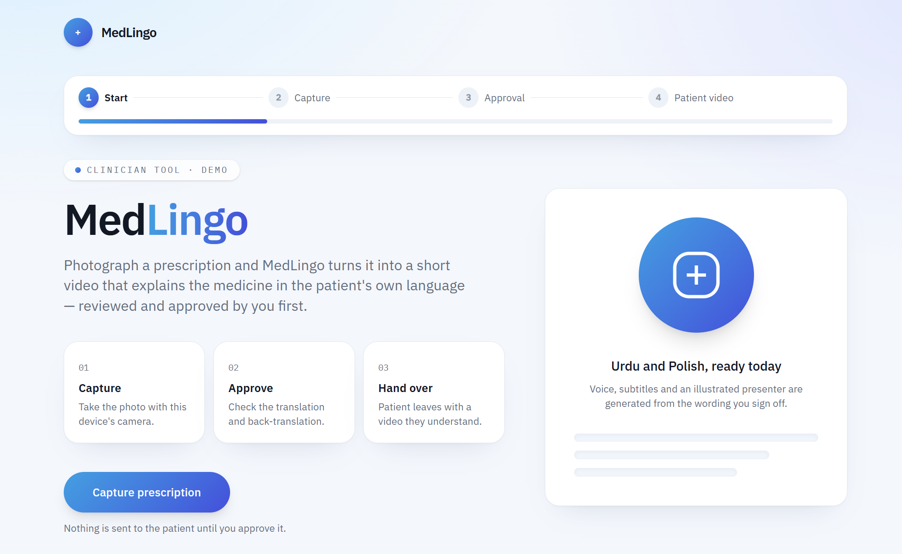
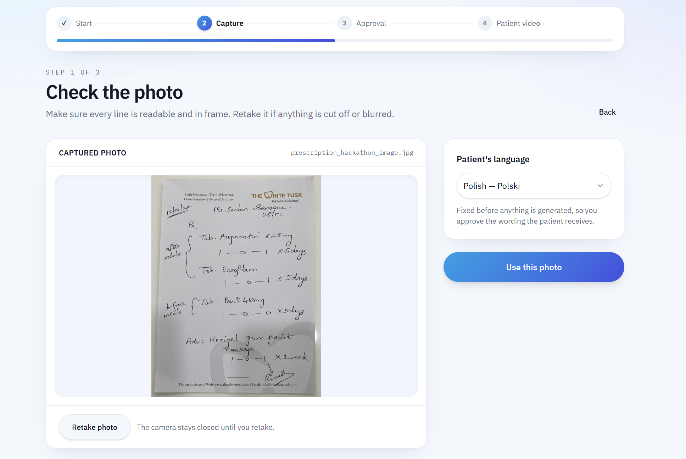
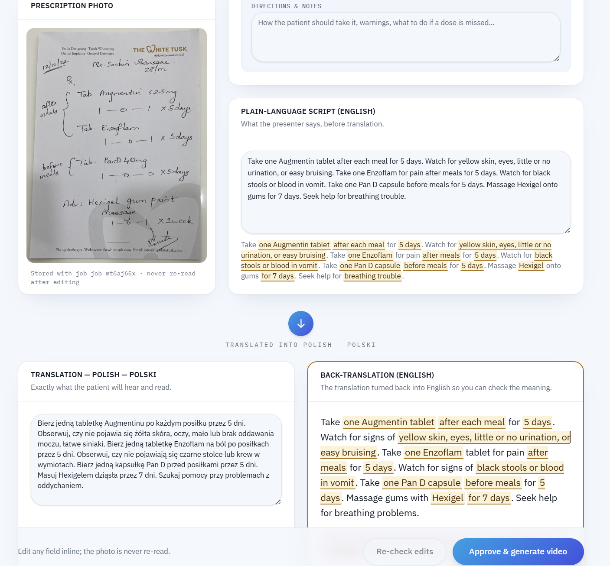
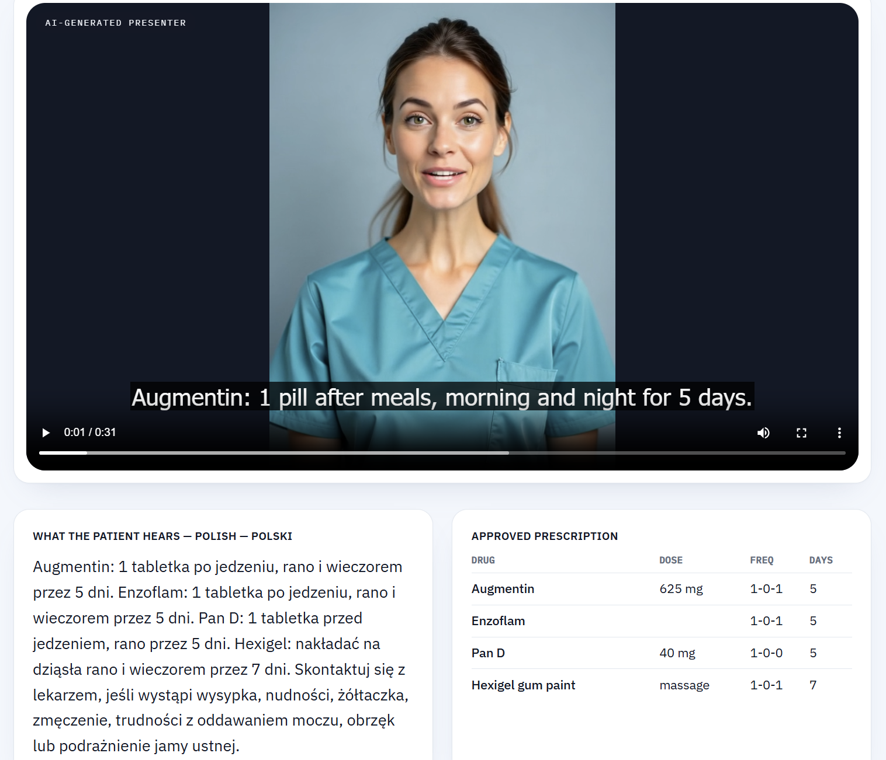

# MedLingo

Photograph a prescription. The patient gets a video explaining it in their own language — after a clinician has read it back and approved every word.



## Why

If you speak English, you leave hospital with discharge instructions you can read. If you don't, there's a good chance you leave with a piece of paper you can't act on: only 8% of patients who prefer another language get their instructions in it.

Translating the paperwork doesn't close the gap on its own. Discharge documents are written around an eighth-to-ninth grade reading level when the guidance says sixth, so a translated leaflet still loses people who then guess at their own dosing. A person speaking to you does not have that problem, which is why the output here is video rather than text.

To be clear about the boundaries: MedLingo doesn't decide anything clinical. It takes a prescription that already exists and makes it comprehensible, and a clinician signs off before a patient ever sees it. It supplements interpreters rather than replacing them.

## What it does

A clinician photographs the sheet and picks the patient's language. That's the entire ask — two seconds, no new workflow, and it works on the paperwork the ward already produces.



Behind that, a vision model reads the sheet and the patient's identity is stripped immediately, before anything is sent anywhere else. Each drug is looked up in its official patient information leaflet, the instructions get rewritten in plain language, and the result is translated.

Then comes the screen the whole project is really about.



The clinician sees what was read off the paper, the plain-English script, the translation, and the translation turned **back** into English. She doesn't speak Urdu or Polish and doesn't need to — she's checking one thing, which is whether the dose survived the round trip. Every drug, dose, frequency, duration and warning is scored against that round trip and highlighted where it drifted. Editing any field re-runs the check before approval becomes possible again.

Only after she taps approve does anything get generated: speech from the approved wording, lip-synced to a presenter, with English subtitles so anyone can verify the content without speaking the language.



## How it's built

```mermaid
flowchart LR
    A([Prescription<br/>photo]) --> B[Read<br/>OpenAI vision]
    B --> C[Strip PII]
    C --> D[Plain-English<br/>script]
    D --> E[Ground in<br/>leaflet · Tavily]
    E --> F[Translate +<br/>back-translate]
    F --> G{{Clinician<br/>approval}}
    G -->|approved| H[Speech<br/>Fal]
    H --> I[Lip-sync<br/>VEED Fabric]
    I --> J([Subtitled<br/>patient video])
    G -.->|edits| F

    style G fill:#fde68a,stroke:#b45309,stroke-width:3px,color:#1c1917
    style A fill:#e0e7ff,stroke:#4338ca,color:#1e1b4b
    style J fill:#dcfce7,stroke:#15803d,color:#052e16
```



A Next.js app in `apps/api` owns the pipeline and exposes it over HTTP; a TanStack Start app in `apps/web` is the clinician interface. They're npm workspaces, so one install and one `npm run dev` runs both.

Four decisions are worth explaining, because they're the ones I'd defend in an interview.

**The approval gate is enforced by the data model, not the UI.** Any project can put a button labelled "approve" in front of a pipeline. Here, generation throws if `approvedAt` is unset, the `PATCH` route refuses to write that field at all, and approve rejects any job that isn't in `awaiting_approval`. Both translations must exist before approval is reachable, and audio and video can only be written after it. The failure mode where a video escapes review isn't a bug you have to remember not to write — it isn't reachable.

**Nobody's face gets cloned.** The input is a photograph, so there's no clinician recording to clone from in the first place, and a system that puts words in a real doctor's mouth isn't one a hospital should deploy. The presenter is a generated person who doesn't exist, labelled as AI on screen. That deletes the consent problem rather than managing it.

**Identity is stripped structurally, then again defensively.** A photographed prescription carries a name, an NHS number, a date of birth. Only whitelisted medication fields survive extraction, so identity can't travel onward by construction — and a regex pass then scrubs identifiers and clinician names that leak into the free-text transcription. A privacy claim shouldn't rest on a language model choosing to follow instructions.

**Renders are tracked by ID, never abandoned.** Video generation goes through Fal's queue with the request id stored on the job. This one came from a real bug: `fal.subscribe` drops the request when a client timeout fires, but the render keeps going and keeps billing, so slow videos were being produced and thrown away. Now a render that outlives its poll loop gets recovered by the next status check.

The `Job` type in [`apps/api/lib/types.ts`](apps/api/lib/types.ts) is the contract the whole system is built around. It moves through `reading → grounding → awaiting_approval → synthesizing → done`, and which fields may be written in which state is what makes the gate enforceable rather than decorative.

## Running it

```bash
git clone https://github.com/shawn-d123/MedLingo.git
cd MedLingo
npm install
```

You can run the whole thing with no API keys at all:

```bash
cp apps/api/.env.example apps/api/.env.local
cp apps/web/.env.example apps/web/.env.local
echo "MOCK_PIPELINE=1" >> apps/api/.env.local

npm run dev
```

Every paid call returns a fixture, so a fresh clone is demoable immediately and stays that way after the API keys expire. The API comes up on port 3000 and the clinician app on http://localhost:8080.

For the real pipeline, fill in the keys instead and generate the presenters once:

| Key | Used for | |
| --- | --- | --- |
| `OPENAI_API_KEY` | Reading the photo, writing and translating the script | Required |
| `FAL_KEY` | Speech, and hosting for the video model | Required |
| `TAVILY_API_KEY` | Grounding each drug in its official leaflet | Recommended |
| `PIONEER_API_KEY` | Extraction cleanup via Fastino's Pioneer | Optional |

```bash
npm run presenter --workspace @medlingo/api -- both
npm run dev
```

`FAL_KEY_2` and `FAL_KEY_3` are optional spares — the pipeline fails over to them automatically when a key runs dry, which it will. `npm run keycheck` tells you which are still alive.

`docker compose up --build` works too, if you'd rather not install anything.

## Checking it still works

```bash
npm run smoke
```

That drives a job through the full state machine against fixtures — no keys, no network, a few seconds — and asserts the things worth protecting: that PII doesn't survive extraction, that the gate can't be bypassed, that edits force re-verification, and that a job reaches `done` with a video and subtitles. It's the first thing to run when coming back to this cold. CI runs it alongside typecheck, lint and build on every push.

There are also CLI harnesses for working against the real APIs without a browser:

```bash
cd apps/api
npm run read -- samples/printed-amoxicillin.png ur
npm run voice-test
npm run render-once
```

They take a photo to a full job object, compare TTS providers in both languages, and render an approved job to a downloaded MP4 respectively. Three sample prescriptions live in [`apps/api/samples`](apps/api/samples): printed single-drug, printed multi-drug, and handwritten.

## Limits

Jobs are held in memory, so restarting the API clears them. That was the right call for a nine-hour build and it's the first thing I'd change — a datastore is maybe an hour's work and it's what stands between this and a real deployment.

Two languages, Urdu and Polish, chosen at intake and fixed before anything is generated. Video generation costs real money and takes one to three minutes depending on how much the sheet says, which is why spoken length is capped.

Pioneer/Fastino is wired in but never actually ran — the account had no billing enabled on the day, so the step skips itself. The integration is in the repo; I'm not claiming a benefit from it.

## Credits

Built in nine hours at the {Tech: Europe} × VEED Summer Lock-In hackathon in London, where it finished **top 5 of 38 teams**.

- **Shawn D'Souza** — generation pipeline and the approval gate: speech, lip-synced video, subtitles, key failover and render recovery, plus the integration that joined the three halves together.
- **Bartosz Olaf Bielecki** — document reading and language: vision extraction, PII stripping, grounding, translation and back-translation.
- **Sasank SK Bavuluru** — the clinician interface: capture, the approval screen and the result view.

Built with OpenAI, Tavily, fal and VEED Fabric 1.0.

## License

[MIT](LICENSE)
